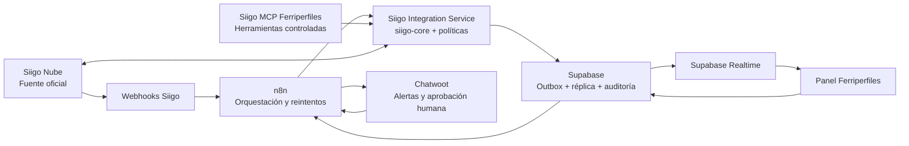

# Plan de ejecución — Siigo MCP e integración Ferriperfiles

**Versión:** 1.0  
**Fecha:** 2026-07-10  
**Estado:** Propuesto para ejecución  
**Infraestructura:** Panel Ferriperfiles, Siigo Nube, Supabase, n8n y Chatwoot

## Registro de ejecución

| Fecha | Verificación | Resultado |
|---|---|---|
| 2026-07-10 | Partner-ID de la aplicación | Confirmado: `ferripanel` |
| 2026-07-10 | Autenticación Siigo Producción | Correcta; token con vigencia de 24 horas |
| 2026-07-10 | Consulta mínima de productos | Correcta; acceso de solo lectura confirmado |
| 2026-07-10 | Fork controlado | Base publicada en `crisgon0295/siigo-mcp-ferriperfiles` |
| 2026-07-10 | Protección de escritura | PR #1 creado en borrador con modo `read_only` por defecto |
| 2026-07-10 | PR #1 | Fusionado en `main` del fork controlado |
| 2026-07-10 | Verificación MCP read-only | 44 herramientas de consulta registradas; 0 herramientas de escritura expuestas |
| 2026-07-10 | Consulta MCP de productos | Correcta contra Siigo Producción, sin exponer datos comerciales |
| 2026-07-11 | Respaldo Supabase | Correcto: archivo PostgreSQL legible, formato custom, 822 objetos |

## 1. Resultado esperado

Construir una integración resistente a fallos donde:

- Siigo Nube sea la fuente oficial de información contable y de inventario.
- Supabase mantenga una réplica operativa, histórica y analítica.
- El Panel Ferriperfiles muestre los cambios mediante Supabase Realtime.
- n8n programe, orqueste, reintente y alerte los procesos.
- Chatwoot concentre alertas y revisiones que necesiten intervención humana.
- El MCP de Siigo permita consultar y ejecutar herramientas autorizadas sin saltarse las reglas de negocio ni la auditoría.

No existe un sistema literalmente infalible. Este plan busca que cada fallo sea detectable, recuperable y no produzca duplicados ni pérdida silenciosa de datos.

## 2. Evaluación del MCP de referencia

Servidor evaluado: `@jdlar/siigo-mcp`, repositorio `jdlar1/siigo-mcp`.

### Capacidades útiles

- Productos, clientes, cotizaciones, facturas de venta y compra.
- Notas crédito, recibos, comprobantes, catálogos y reportes.
- Consulta y administración de webhooks de Siigo.
- Esquemas Zod y tipado TypeScript para validar payloads.
- Herramientas marcadas como lectura o destructivas.

### Riesgos que obligan a encapsularlo

- Es un proyecto comunitario pequeño y no es software oficial de Siigo.
- La instalación publicada usa `npx` y transporte local de cliente MCP; hay que validar o añadir un transporte remoto autenticado para n8n y otros consumidores.
- Expone operaciones destructivas como borrar productos, facturas, cotizaciones y webhooks.
- Una actualización automática del paquete podría cambiar esquemas o comportamiento.
- No sustituye una cola, auditoría, reconciliación ni reglas de negocio.

### Decisión

1. Crear un fork controlado por Ferriperfiles.
2. Fijar versión y commit; nunca ejecutar `latest` en producción.
3. Auditar dependencias, autenticación, logs y herramientas destructivas.
4. Exponer primero un perfil `read-only`.
5. Reutilizar un módulo común `siigo-core` para el MCP, los jobs y la API del panel.
6. Añadir escritura por recurso únicamente después de pruebas y aprobación explícita.

## 3. Arquitectura objetivo

### Responsabilidad de cada componente

| Componente | Responsabilidad | No debe hacer |
|---|---|---|
| Siigo Nube | Contabilidad, documentos fiscales, inventario y datos ERP oficiales | Depender del panel para conservar información contable |
| Supabase | Réplica operativa, histórico, outbox, auditoría, KPIs y eventos para Realtime | Guardar credenciales Siigo accesibles desde el navegador |
| n8n | Scheduler, recepción de webhooks, lotes, reintentos, alertas y reconciliación | Convertirse en la única copia de reglas críticas o datos |
| Integration Service | Autenticación Siigo, rate limit, validación, mapeo, idempotencia y políticas | Exponer directamente secretos o endpoints sin autenticación |
| MCP | Consultas y acciones autorizadas para agentes/operadores | Ejecutar borrados o contabilización autónoma en la primera etapa |
| Panel | Experiencia operativa y analítica | Llamar a Siigo directamente desde el navegador |
| Chatwoot | Alertas, incidentes y pasos con intervención humana | Actuar como bus de datos o fuente de verdad |

## 4. Flujo de datos

### Siigo → Panel, casi en tiempo real

1. Siigo envía un webhook a un endpoint protegido de n8n.
2. n8n registra el evento en `siigo_webhook_events` usando una clave única.
3. El Integration Service vuelve a consultar el objeto completo en Siigo; no confía únicamente en el payload del webhook.
4. Se normaliza y actualiza la réplica correspondiente en Supabase.
5. Supabase Realtime notifica al panel.
6. Un proceso nocturno reconcilia diferencias que un webhook haya perdido.

### Panel → Siigo

1. El usuario realiza un cambio en el panel.
2. Supabase guarda el cambio como comando `pending` en `integration_outbox`.
3. n8n toma el comando con lock y llama al Integration Service.
4. El servicio valida permisos, reglas, versión y posibles conflictos.
5. Siigo procesa la operación.
6. Supabase registra ID externo, request, resultado, estado y número de intentos.
7. El panel recibe la confirmación por Realtime.

### Reconciliación nocturna

1. n8n ejecuta el workflow a las `00:00` en `America/Bogota`.
2. Consulta recursos actualizados desde el último cursor exitoso.
3. Pagina en lotes con rate limit configurable.
4. Actualiza clientes y productos, incluyendo precios, existencia total y existencias por bodega cuando estén disponibles.
5. Compara conteos y checksums básicos.
6. Cierra `sync_run` como `success`, `partial` o `failed`.
7. Si hay error o anomalía, crea una conversación/alerta en Chatwoot.

## 5. Modelo mínimo en Supabase

### Tablas de integración

- `siigo_connections`: compañía, entorno y estado; sin secretos visibles al cliente.
- `siigo_entity_map`: `entity_type`, `local_id`, `siigo_id`, `siigo_code`, `last_synced_at`.
- `siigo_sync_runs`: tipo, cursor, inicio, fin, conteos, estado y error resumido.
- `siigo_sync_events`: entidad, operación, origen, payload normalizado, resultado e intento.
- `siigo_webhook_events`: topic, event key, payload original, recibido/procesado y error.
- `integration_outbox`: comando, recurso, payload, versión, idempotency key, estado e intentos.
- `integration_dead_letters`: operaciones agotadas que necesitan intervención.

### Campos que requieren las réplicas

- `siigo_id` y código/identificación de negocio.
- `last_synced_at` y `siigo_last_updated`.
- `sync_status`: `synced`, `pending`, `conflict`, `error`.
- `sync_hash` para detectar cambios relevantes.
- `source_of_truth` cuando el recurso admita edición en más de un sistema.

## 6. Seguridad y controles

- Guardar `SIIGO_USERNAME`, `SIIGO_ACCESS_KEY` y `SIIGO_PARTNER_ID` en secretos del servidor/n8n; nunca en el frontend ni en tablas públicas.
- Rotar cualquier credencial que haya sido incluida previamente en código o logs.
- Cachear el token de Siigo en servidor y renovarlo antes de expirar.
- Autenticar el gateway MCP remoto con TLS, token de servicio y allowlist de consumidores.
- Separar roles MCP: `reader`, `operator`, `accounting_approver`, `admin`.
- Deshabilitar por defecto herramientas `delete`, `annul` y operaciones contables irreversibles.
- Aplicar aprobación humana para facturas, notas crédito, anulaciones, compras y comprobantes.
- Usar `Idempotency-Key` donde Siigo lo soporte y deduplicación interna en todos los demás recursos.
- Implementar backoff exponencial con jitter y circuit breaker ante errores repetidos.
- Alertar por tasa de error; Siigo puede bloquear temporalmente usuarios con uso incorrecto sostenido.
- Ejecutar RLS en tablas Supabase y mantener service role únicamente del lado servidor.
- Censurar credenciales, NIT, correos y payloads sensibles en logs técnicos.

## 7. Workflows n8n

| ID | Workflow | Disparador | Resultado |
|---|---|---|---|
| N8N-01 | `siigo-webhook-ingest` | Webhook | Deduplica, registra y encola evento |
| N8N-02 | `siigo-event-hydrate` | Evento pendiente | Consulta Siigo y actualiza Supabase |
| N8N-03 | `siigo-nightly-products` | 00:00 America/Bogota | Productos, precios, stock y bodegas reconciliados |
| N8N-04 | `siigo-nightly-customers` | Después de N8N-03 | Clientes reconciliados |
| N8N-05 | `siigo-outbox-worker` | Intervalo corto | Envía comandos autorizados del panel |
| N8N-06 | `siigo-sales-facts` | Webhook + reconciliación | Actualiza ventas y hechos analíticos |
| N8N-07 | `siigo-dead-letter-alert` | Error workflow | Abre incidente en Chatwoot |
| N8N-08 | `siigo-daily-control-report` | 06:00 America/Bogota | Resumen de sincronización y diferencias |

Cada workflow debe incluir timeout, correlation ID, límite de concurrencia, reintentos, manejo de `429/5xx`, workflow de error y enlace a la ejecución fallida.

## 8. Herramientas MCP por etapas

### Etapa A — Solo lectura

- Productos, clientes, cotizaciones, facturas y compras: listar/consultar/buscar.
- Catálogos: documentos, impuestos, vendedores, bodegas y listas de precio.
- Reportes contables de consulta.
- Estado de webhooks.

### Etapa B — Escritura de bajo riesgo

- Crear/actualizar clientes.
- Crear/actualizar productos con validación de grupo, impuestos y código único.
- Crear/actualizar cotizaciones.

### Etapa C — Escritura contable con aprobación

- Facturas, compras, recibos, notas crédito y comprobantes.
- Toda acción genera vista previa, aprobación humana, idempotency key y auditoría.

### Fuera de alcance inicial

- Borrar productos o cotizaciones.
- Borrar/anular facturas automáticamente.
- Permitir que un agente cambie catálogos contables sin aprobación.

## 9. Fases y puertas de calidad

### Fase 0 — Preparación y auditoría (2–3 días)

- [ ] Obtener credenciales de sandbox/pruebas y un `Partner-Id` propio.
- [ ] Crear fork del MCP y fijar la versión base.
- [ ] Revisar dependencias, transporte MCP, logs y operaciones destructivas.
- [ ] Rotar secretos y definir desarrollo/pruebas/producción.
- [ ] Definir matriz fuente de verdad y permisos.

**Puerta:** ninguna escritura contra producción; conexión autenticada y auditoría aprobada.

### Fase 1 — MCP read-only (3–5 días)

- [ ] Ejecutar MCP localmente con sandbox.
- [ ] Verificar consultas de productos, clientes, cotizaciones, facturas y catálogos.
- [ ] Añadir perfiles de herramientas y desactivar las destructivas.
- [ ] Probar MCP Client de n8n; si el paquete solo ofrece `stdio`, añadir gateway Streamable HTTP autenticado.
- [ ] Registrar cada llamada con correlation ID, usuario/herramienta y duración.

**Puerta:** 100 consultas controladas sin secretos en logs y resultados comparados con Siigo Nube.

### Fase 2 — Réplica y sincronización nocturna (5–8 días)

- [ ] Crear migraciones Supabase del modelo de integración.
- [ ] Implementar sincronización incremental de productos y clientes.
- [ ] Crear workflows N8N-03, N8N-04, N8N-07 y N8N-08.
- [ ] Configurar zona horaria explícita `America/Bogota`.
- [ ] Hacer carga inicial y reconciliación completa.

**Puerta:** tres ejecuciones nocturnas consecutivas correctas; repetir el job no duplica registros.

### Fase 3 — Webhooks y experiencia Realtime (4–6 días)

- [ ] Registrar topics Siigo disponibles para productos, clientes y documentos relevantes.
- [ ] Implementar N8N-01 y N8N-02 con deduplicación.
- [ ] Verificar eventos consultando de nuevo la entidad en Siigo.
- [ ] Activar canales privados Supabase Realtime con RLS.
- [ ] Mostrar `última sincronización` y estado por registro en el panel.

**Puerta:** actualización visible en el panel dentro del objetivo definido y reconciliación nocturna sin diferencias.

### Fase 4 — Escritura desde el panel (7–10 días)

- [ ] Crear outbox, worker y dead-letter queue.
- [ ] Activar clientes, después productos y finalmente cotizaciones.
- [ ] Probar concurrencia, red caída, timeout, `429`, `5xx` y conflictos de versión.
- [ ] Añadir aprobación humana a operaciones contables.

**Puerta:** ninguna duplicación en pruebas de reintento; trazabilidad completa local↔Siigo.

### Fase 5 — Analítica y Chatwoot (5–8 días)

- [ ] Crear hechos de ventas, dimensiones y agregados diarios/mensuales.
- [ ] Alimentar KPIs del panel desde Supabase, no directamente desde Siigo.
- [ ] Implementar alertas Chatwoot para fallos, conflictos y aprobaciones.
- [ ] Crear reporte diario de control y tablero de salud de integración.

**Puerta:** KPIs conciliados con Siigo para períodos de prueba y alertas verificadas.

## 10. Pruebas obligatorias

- Contrato de payload para cada endpoint/MCP tool usado.
- Paginación completa y cursores incrementales.
- Idempotencia y deduplicación de webhooks.
- Token expirado, credenciales inválidas y permisos insuficientes.
- Rate limit, timeout, error transitorio y circuit breaker.
- Edición simultánea en Siigo y panel.
- Recuperación desde dead-letter sin edición manual de base de datos.
- Reconciliación de conteos, IDs, precios, impuestos y cantidades por bodega.
- RLS y pruebas de acceso por rol.
- Restauración de respaldo antes de habilitar escrituras productivas.

## 11. Métricas operativas

- Latencia Siigo → Supabase → panel.
- Porcentaje de eventos procesados correctamente.
- Comandos pendientes, fallidos y en dead-letter.
- Duración y cobertura del job nocturno.
- Diferencias detectadas por reconciliación.
- Solicitudes Siigo por minuto y tasa de `4xx/5xx/429`.
- Edad del dato por entidad.
- Número de operaciones que requirieron aprobación o corrección.

## 12. Primer sprint recomendado

1. Rotar secretos y crear credenciales de prueba.
2. Crear el fork de `siigo-mcp` y fijar la versión evaluada.
3. Ejecutarlo en modo lectura contra sandbox/pruebas.
4. Definir y crear las tablas de auditoría, mapeo y sync runs.
5. Construir la sincronización manual de productos.
6. Validar precios, stock total y stock por bodega contra Siigo Nube.
7. Repetir con clientes.
8. Solo entonces automatizar la ejecución de medianoche.

## 13. Fuentes técnicas

- MCP evaluado: https://github.com/jdlar1/siigo-mcp
- API oficial Siigo: https://developers.siigo.com/docs/siigoapi/
- Autenticación Siigo: https://developers.siigo.com/docs/siigoapi/autenticacion/autenticacion
- Idempotencia Siigo: https://developers.siigo.com/docs/siigoapi/idempotencia
- Webhooks Siigo: https://developers.siigo.com/docs/siigoapi/webhooks/1-create-webhook
- Productos Siigo: https://developers.siigo.com/docs/siigoapi/productos/listar-productos
- n8n Schedule Trigger: https://docs.n8n.io/integrations/builtin/core-nodes/n8n-nodes-base.scheduletrigger/
- n8n Queue Mode: https://docs.n8n.io/hosting/scaling/queue-mode/
- Supabase Realtime: https://supabase.com/docs/guides/realtime/subscribing-to-database-changes
- Supabase Cron: https://supabase.com/blog/supabase-cron
